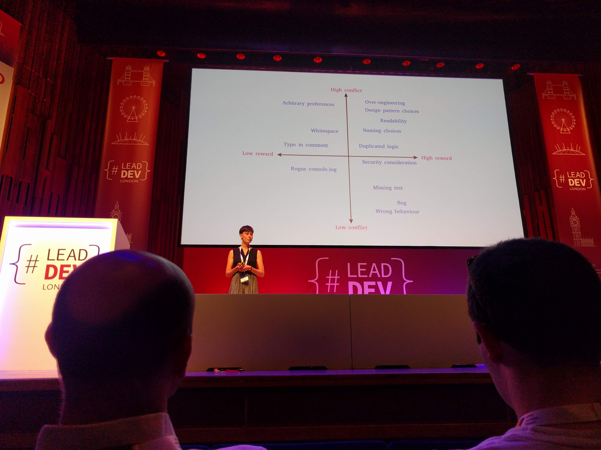

# 'Giving and Recieving Code Reviews Gracefully' by Alexandra Hill (Dev @ Imperial College) [@alexhillphd](https://twitter.com/alexhillphd)

VIDEO: [here](https://www.youtube.com/watch?v=XY6eA2_2hOg&list=PLBzScQzZ83I_VX8zgmLqIfma_kJs3RRmu&index=17&t=0s). SLIDES: TBA.

## Why Review

Don't be defensive!

## How then?

There are all sorts of different ways to resolve conflict:

There are also some really basic ways to resolve conflict, like the "Dual Concerns Model"

- What can we do as an organisation?
- What can you do as a reviewer?
- What can you do as an author?
  - "As if"-technique.
