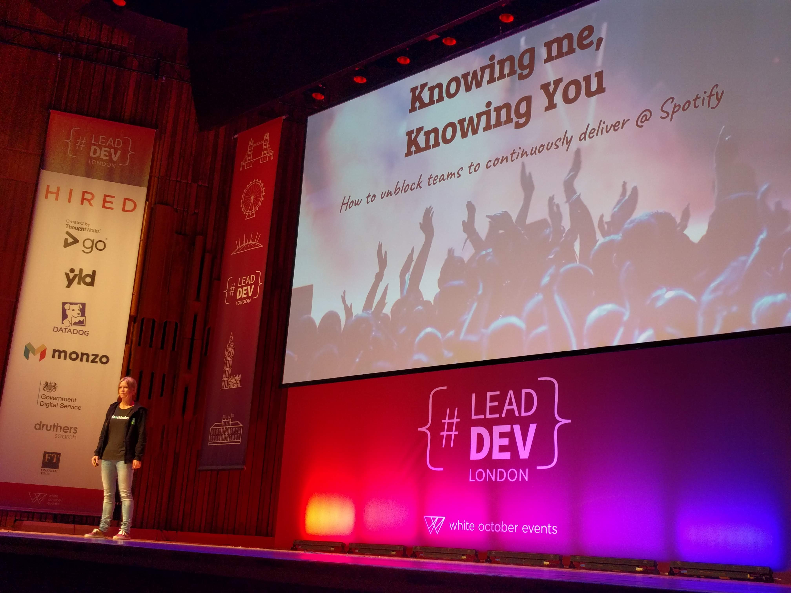

# 'Knowing me, knowing you: growing teams to continously deliver' by Pia Nilsson (EngMgr @ Spotify) [@pia_nilsson](https://twitter.com/pianilsson)

> This is a story about the journey of the CI/CD team, while getting them to deliver more.

VIDEO: [here](https://www.youtube.com/watch?v=S92vVAEofes&list=PLBzScQzZ83I_VX8zgmLqIfma_kJs3RRmu&index=16&t=0s). SLIDES: TBA.

---

1. Recap: flow in an Engineering Team is similar to a Scrum team. Limit WIP. Finding Bottlenecks in people, process in systems.
1. Spotify had lots of stuff that was stuck in WIP with lots of people leaving and joining th eteam.
1. Leant on the LEAN and Agile practices:
    - Implementing WIP limits and tried to optimise the flow of work
    - TDD & BDD
    - Pairing and Mobbing
    - Now not as fun! :(

## What were our blockers (as quotes)

> I can't do brainstorming because I haven't had time to think on my own first.
- Get the talking going - used the ideas behind "psychological safety" to get conversations rolling
- Code Creme Brulee: Hard on the surface, and soft on a inside. Let's break this up by asking "stupid questions"
- "Toxic Communications" training to avoid criticism, stonewalling, defensiveness and contempt within the team.

> I'm interrupted all the time.
- Introduce Active Listening: YES AND, not NO/BUT.
- Introduce "Wait your turn" rule during passionate discussions.

> We think so differently, it's just better if we don't pair together.
- Friendly Feedback training, introduced "non-violent communciation format" or "transparency model" of communication.
- Introduced "Turn up the good" from positive psychology: take everything that's working well, and find a way to turn it up to 11.

> I'm not sure about the purpose of this time or what I'm doing here?
- Answer "Why" by implementing OKR's with inspirational objectives and KR's of REAL measurements: no how, just facts.
- "Despicable Design" exercise from UX-world. Define worst-possible user experience by thinking about your users, not just deadlines or stakeholders/PMs.

After all this, it's lower stress, less anxiety, less conflict, increased optimisation of flow of work and reduced friction within team and their stakeholders, BUT, iterate with team! Always getting better because people are swapping in/out of the team.

## Takeaways

- Investigate non-violent communication model.