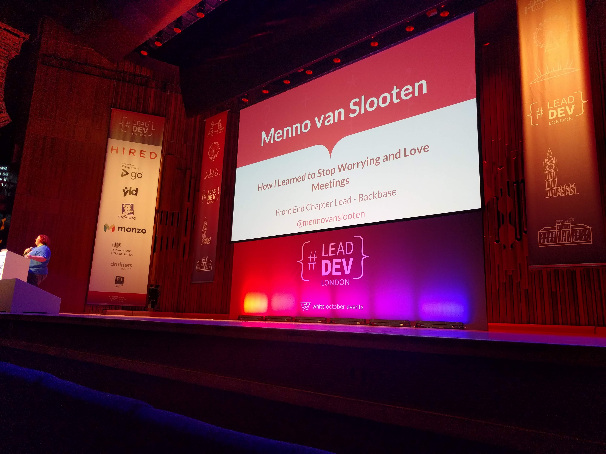

# 'How I Learned to Stop Worrying and Love Meetings' by Menno van Slooten (Lead @ Backbase) [@mennovanslooten](https://twitter.com/mennovanslooten)

VIDEO: [here](https://www.youtube.com/watch?v=PFk9yhEqcN4&list=PLBzScQzZ83I_VX8zgmLqIfma_kJs3RRmu&index=15&t=0s). SLIDES: TBA.

Very personal story, not truthful, just insightful. \
Let's have a chat about how i learned to like being a (Chapter) Lead. \
This was not a great experience for me.

## Key quotes + explanations

> I used to love programming. I still do, but I used to, too!

The older I got, and the more experienced I got, the louder the voice in the back of my head became: Am I getting too old for this?

> Becoming a Lead is the subtle art of not making a difference.

I didn't create anything on a day-to-day basis. I would sit in meeting after meeting about nothing to do with programming.
I still took pride in my work, I wrote some damn fine emails!
I should have spoken to other Lead Developers earlier; everyone around me was having the same problems, you're not alone!

> Learning to love meetings is just a matter of perspective.

There is no four-step process for this, but first I had to let go of programming, then my manager sent me an email and asked me to evaluate the people that I managed and asked me to map my reports to the new job titles. There were two people in my group that were over-performing and I used all my email writing powers to support them and they ended up getting a promotion (and a raise). This taught me that I have a lot of power to enable others to grow. Me attending meetings meant that developers could continue with the flow and work properly. THis is powerful.

> With great power comes great opportunity

I like helping others because it makes me feel valuable.
Think about ways that you can use your power within an organisation to empower others!

## Notes

Was a great story.
