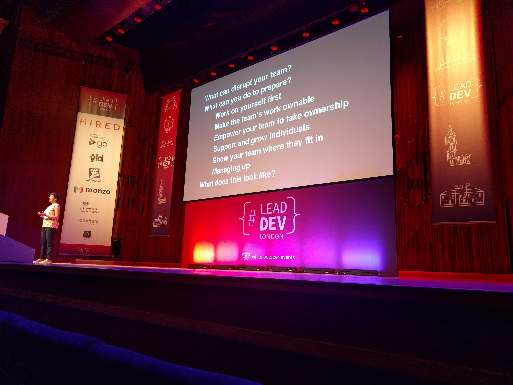

# 'Building Sustainable Teams to Handle Uncertainty' by Jenny Duckett (Architect @ Ministry of Justice) [@jenny_duckett](https://twitter.com/jenny_duckett)

VIDEO: [here](https://www.youtube.com/watch?v=72FMIy_wX68&list=PLBzScQzZ83I_VX8zgmLqIfma_kJs3RRmu&index=14&t=0s). SLIDES: TBA.

---

> Think about the best experience you've had working with a team!

Jenny tells us about her experience:

Change is a good thing!

## What can disrupt a team?

- People leave and join teams
- Senior leaders move
- Wider priorities shift
- Teams are reorganised out of existence
- Emotions are critical! (Larah Hogan desk move blog post)

## What can you do?

- Work on yourself first
  - We can prepare for change
  - Don't do it all yourself
  - Give people your trust
  - Build your support network
  - Set yourself up to lead sustainably
- Make the teams work ownable
  - Define a single, clear goal, because focus is invaluable
  - Communicate it over and over again
  - Give your team the background they need for each piece of work (User Story Context, Story Kickoffs, Workshops)
- Empower the team to own it  
  - Embrace opportunities for positive change
  - Become great at integrating new people into the team (constantly improve onboarding)
  - Recognise that everyone is constantly learning
  - Share understanding of your work in the team (commit messages, comments on tickets, updated docs, decision logs)
  - Mob programming (check blog post from GDS about top 12 mob programming thoughts)
  - Taking ownership helps people handle change.
- Support and grow individuals
  - Use every piece of work to help someone grow
  - Start with individual needs
  - Delegate effectively
  - Teach people to do your job
  - Grow the next generation of leaders
  - Grow people for a resilient team and organisation
- Show your team where they fit in
  - Look beyond your team
  - Show the team how their work fits into the bigger picture
  - Don't over-insulate your team
  - A wider view helps people adapt when things change
- Manage upwards
  - Communicate your teams capacity for change
  - Ask for support to build a sustainable team
  - You need their trust
  - Show them why all your teams work matters
  - Good communication about change is vital

## What does this look like?

- Grow sustainable teams for a sustainable orgnisation
- It's even more important to empower people during tough times.

## Notes

This is probably a good talk for the Management Team or team leads with lots of disturbances??