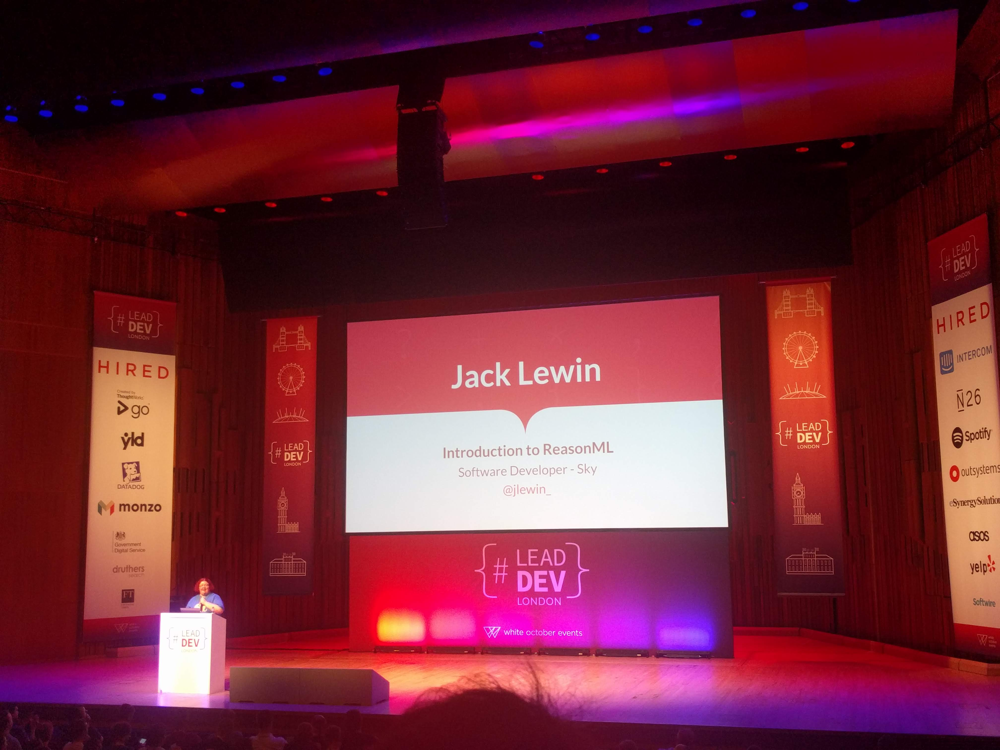

# 'Introduction to ReasonML' by Jack Lewin (Dev @ Sky) @jlewin_

VIDEO: [here](https://www.youtube.com/watch?v=oKyoXl8jnCI&list=PLBzScQzZ83I_VX8zgmLqIfma_kJs3RRmu&index=12&t=0s). SLIDES: TBA.

---

> _"People that came to React, are now tweeting about ReasonML..."_

## Background

> ReasonML is a JS Interpreter for OCaml

## Types

- It's typed, but moreso than TypeScript
- Build time == Run time, no more runtime type errors
- Pattern Matching works on types & compiler can help you prevent missing cases

## JS Interop

- BuckleScript transpiles Reason into JavaScript
- You can use JavaScript shit via BuckleScript
- Can compile to Native (no idea what this means)

## Notes

- Sounds like it's trying to find a solution for a problem that doesn't exist.
- Presenter would not stop pacing the stage, and leave hanging sentences.
