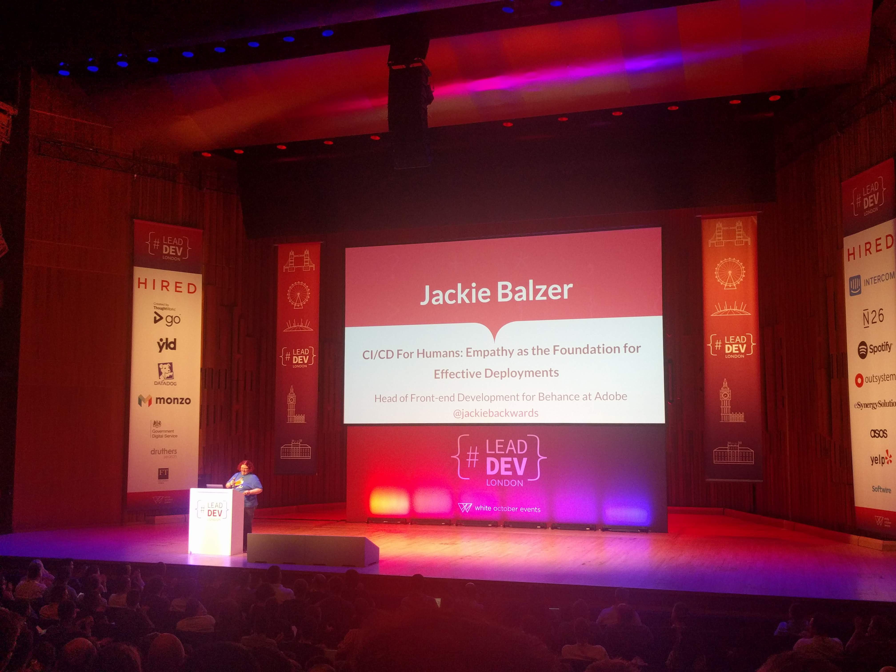

# 'CI/CD for Humans: Empathy as the Foundation for Effective Deployments' by Jackie Balzer (Head of FE Dev @ Behance/Adobe) @jackiebackwards

VIDEO: [here](https://www.youtube.com/watch?v=eB1P6GjXvuQ&list=PLBzScQzZ83I_VX8zgmLqIfma_kJs3RRmu&index=13&t=0s). SLIDES: TBA.

> _"This is not about DevOps (or Behance, the product)"_

## What makes a good deploy?

- Empathy!
> Instead of "What is the LEAN/AGILE choice?", why not ask "What is the Compassionate Choice?"
- Ownership is empowering

## Notes

I didn't take notes here, because this is all obvious! \
We are doing this, just watch the video.