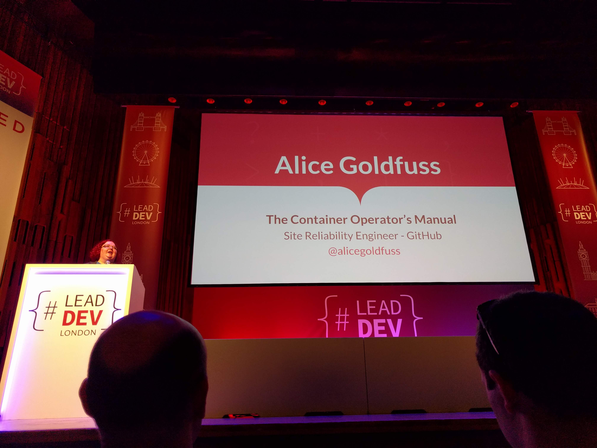

# 'The Container Operators Manual' by Alice Goldfuss (SRE @ GitHub) [@alicegoldfuss](https://twitter.com/alicegoldfuss)

Container talks are normally "labratory settings" - it's not representative of real world environments. \
Containers are a good use-case, but we need to be a little more critical! \
Containers aren't magic, they are built from a bunch of Linux processes that are stapled together.

## Containers have strengths

- Stateless applications!
  - Applications that take data in, mutates it, and then sends it out. Think awk, sed, F#, etc.
  - Microservices, etc can also work, so long as there are many instances and they don't affect each other.
  - Just make your applciations portable before you start and it'll be easier.
- Easy to iterate and operate - just make a change, deploy it.
- Disaster Recovery is also a strength that most people skip over...
- Testing Environments are also fun to play with containers.

## Containers have weaknesses

- Stateful applications!! Databases!
  - Use the cloud providers and some tooling instead!

## Containers need friends

- Requires a lot of support and assistance from tooling and frameworks and libraries
  - Dev Tooling
  - Orchestration
  - Management
  - Networking
  - Deployment
  - Monitoring
  - Provisioning
  - Debugging!

> To figure all this stuff out, you'll need a MINIMUM of 1 year, for one service, in one container, in a Production environment

## Containers need headcount

- You need a lot of people, and support and assistance from LOTS and LOTS of people.
- You can't just hand this off to "Ops" - you will need a completely new team with all sorts of skills:
  - Operations
  - Deployments
  - Tooling
  - Monitoring
  - Kernel engineering
  - Networking
  - Information Security (esp. related to Container Security)
  - Internal Adoption (good relationships within the organsation)
  - Project Manager (and internal advocate/support)
- These skills don't need to be one person, but they definitely can't be ONE person. It needs to be 4 people or more (ideally 6-8)
- Empower them to succeed! Budget, management support, mandates, space to fail, general platform support.

## Should we run containers in Prod

> "It Depends", see above.

"Do you want containers, or a blog-post??" - don't do it because it's "cool". It's OK not to use containers.

### NOTES

Q: Where does she get her slides from? So many black & white, aged photos, was very stylish.