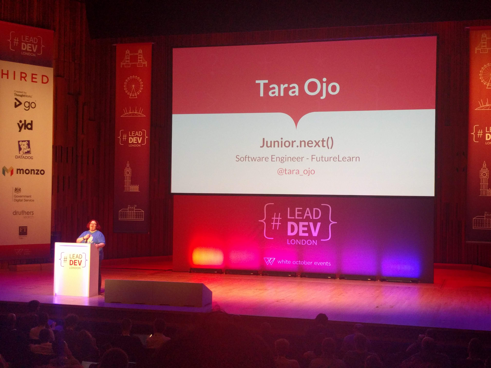

# 'Junior.next()' by Tara Ojo (Dev @ FutureLearn) @tara_ojo

## "Junior should" vs "Supporters should"

The talk is divided into two sections: **Junors** and **Supporters**

## Juniors Should

- Stretch themselves
- Are able to teach others!
- Should move themselves out of their comfort zone, into the stretch zone, but not as far as the panic zone
- Are able to make changes in their business, including experimenting safely
- Should gather evidence of their achievements

Check out this [tweet from Carolyn Stranksy](https://twitter.com/carolstran/status/1010517986829045760) for more background.

## Supporters Should

- Invest time into their juniors
- Allow time for "good" pairing, let them drive and be engaged.
- Ask open questions
- Create opportunities
- Give regular feedback (inc. confirmation of their work/level)
  - Make it specific and actionable

> Include screenshot of life-cobweb thing and talk about how the orange section is her goal and white is confidence.

### Note

_This could be an interesting exercise for some Leads with their teams?_

## Take aways

> Include screenshot of the "More, Less, Start, Stop and Keep" diagram

**Juniors** should stretch themselves, make changes and gather evidence. \
**Supporters** should invest time, create opportunities and give regular feedback.