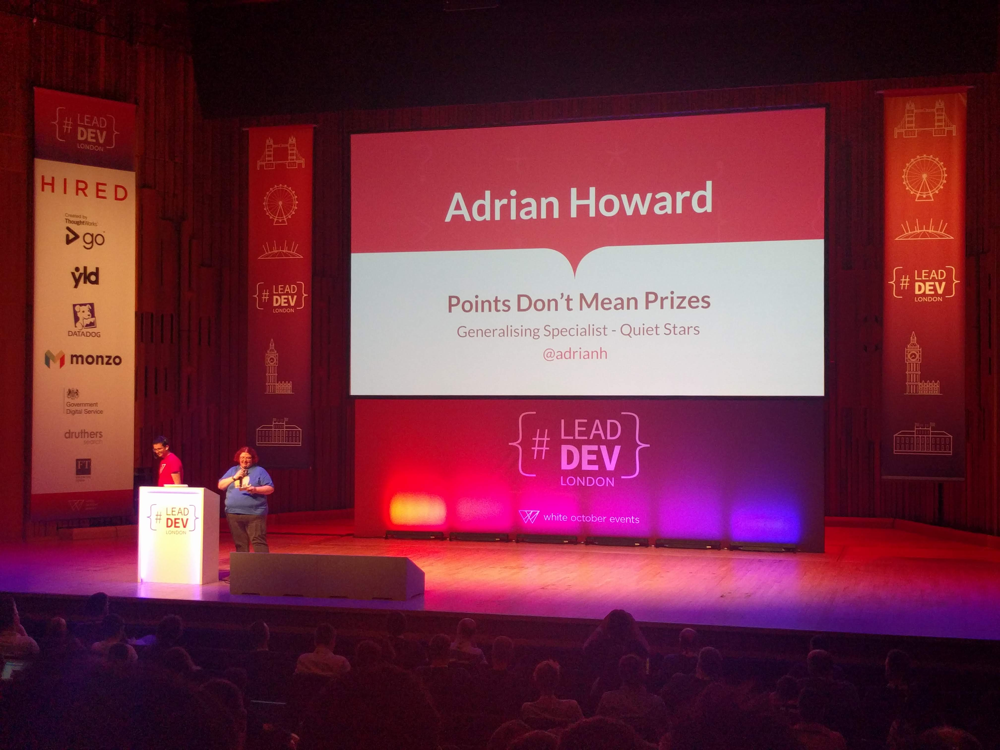

# 'Points don't mean Prizes' by Adrian Howard (Dev @ QuietStars) @adrianh

VIDEO: [here](https://www.youtube.com/watch?v=uxdouZL6imw&list=PLBzScQzZ83I_VX8zgmLqIfma_kJs3RRmu&index=6&t=0s). SLIDES: TBA.

## Introduction

Story time, talking about the North Star

## Customers don't care about stories, or points

They just want the value that the story will give them!

### NOTE

_There was a good story about Customer Journeys; watch the video._

## Three questions that can help

1. Can we take a story and bin it (or delay it)?
2. Can we take a story and thin it?
3. Can we take a story and split it? (into smaller stories that definitely provide value?)

Feel free to rinse and repeat this process into infinity!

## Good companies

> Insert screenshot of North Star slide

## KEY TAKEAWAYS

- All stories should be value-based!

## READ

- User Story Mapping by Jeff Patton
- quietstars.com