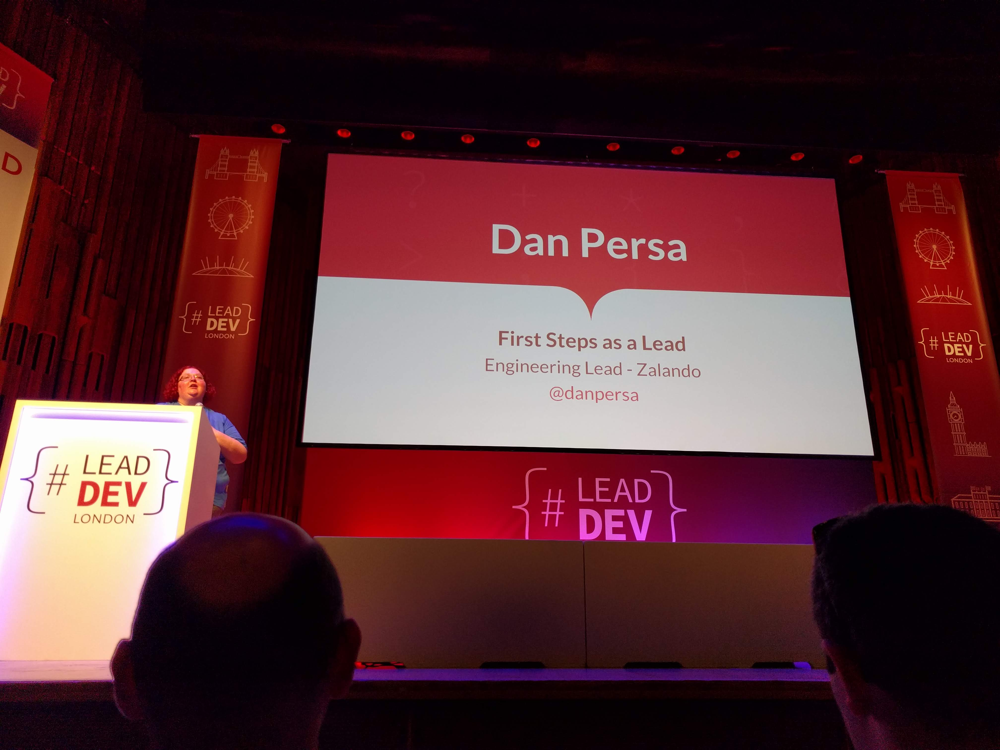

# 'First Steps as a Lead' by Dan Persa (TL @ Zalando) [@danpersa](https://twitter.com/danpersa)

Engineering Lead at Zalando in Berlin. \
_Very robotic voice & quite stiff._

## Let's start with WHY

- Read the Job Description & make sure the role fits your expectations.
- Get Support, maybe offering mentoring & assistance as a Lead.
- Lots of meetings!!
- Career switch, this is not a regular promotion, but a switch in career: DRY doesn't work in a management role.
- Learn fast:
  - Get a mentor
  - Apply what you read in books
  - Former leads
- Trust instead of control
  - Earn respect of the team
  - Regular syncs with feedback in both directions
  - Be transparent
  > Team has solutions, TL's role is to help the team discover the solutions.
  - Feedback Loop & instant gratification (Social Media, or TDD)
- Not taking a decision, is a decision
- Implement a Feedback Culture

## NOTES

Q: Good summary slide - grab it from the video or off Twitter?