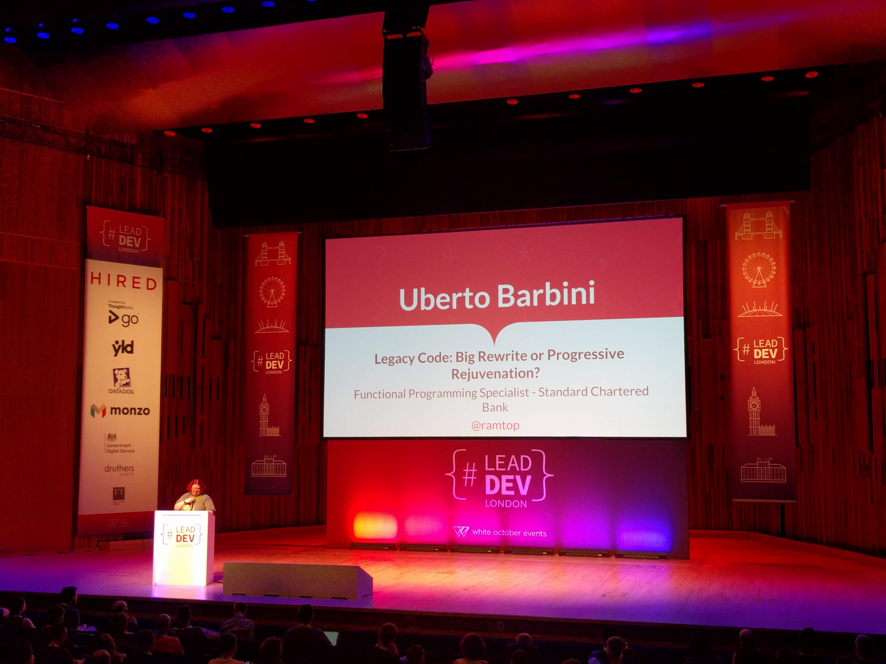

# 'Legacy Code: Big Rewrite or Progressive Rejuvenation?' by Uberto Barbini (Functional Specialist @ Standard Charter Bank) @ramtop

VIDEO: [here](https://www.youtube.com/watch?v=-lB74Zg3QSw&list=PLBzScQzZ83I_VX8zgmLqIfma_kJs3RRmu&index=7&t=0s). SLIDES: TBA.

---

Legacy systems: They were great at their time, but now nobody wants to work on them.

Progressive Rewrite is also called the Strangler Pattern (from Martin Fowler)

## Keywords

- Modules
- End-to-end tests
- Self-promotion

## Notes

Unfortunately, quite hard to understand, or follow...? \
This talk seems common sense, but also poorly prepared and slides are a mess \
:facepalm: I didn't enjoy this talk.