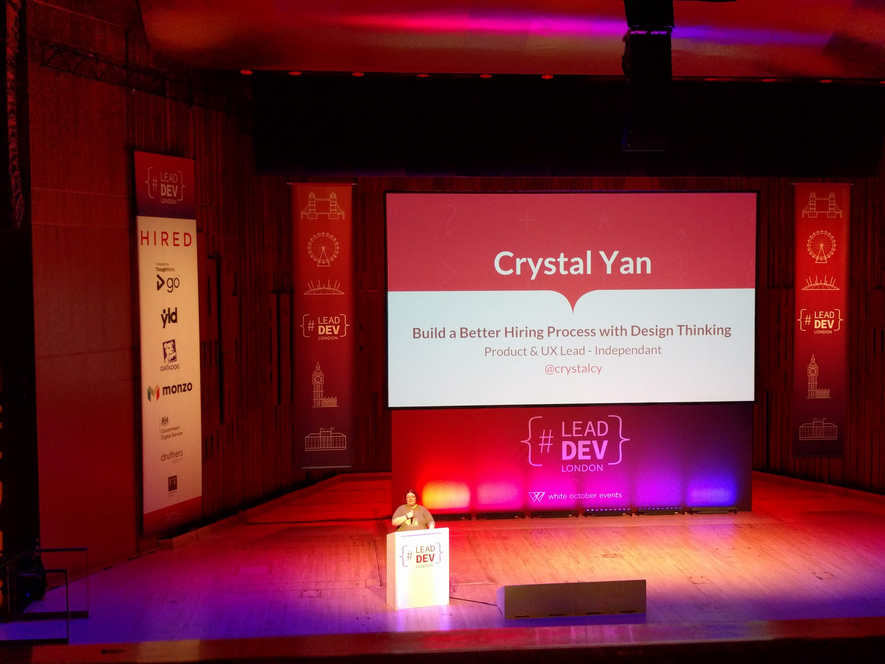

# 'Build a Better Hiring Process with Design Thinking' by Crystal Yan (Independant UXer & PM Lead) @crystalcy #buildbetterhiring

VIDEO: [here](https://www.youtube.com/watch?v=zeE43nyCQVg&list=PLBzScQzZ83I_VX8zgmLqIfma_kJs3RRmu&index=8&t=0s). SLIDES: TBA.

---

## Introduction

- Why does this matter?
  - Hiring is expensive - not just cost, but also opportunity cost
  - Ensure less bias, more diversity, less frustration and higher yield

## Methods

- Experiential techniques:
  - Conduct exploratory research
    - Focus on neutral que stions
  - Mapping candidate experience
  - Prototype possible solutions
  - Ship and iterate on feedback

## Case Studies on Quick Wins

- **Too many contacts**
  - Found via Journey Mapping.
  - Reduce this to one per candidate
  - It's not a team effort, it's just confusing & disorganised

- **Duplicate questions**
  - Create interview guides, templatea and assessment guidelines
  - These resources are key

## Take aways

- Hiring is expensive
- User Interviews help discover user-pain-points
- Inclusive Hiring Process leads to less bias and higher yield
- Quick wins like clarifying roles is important
- Journey Maps can really help here
- Don't be scared of paper prototypes when designing a new system

## Notes

- Slides were very bright yellow and light (with thin light gray font on white or yellow background) - this made the slides hard to read!
- Duplicate CTA's on lots of slides: hashtag + twitter
- Check out Lever (Recuitment tooling): [lever.co](https://www.lever.co/)