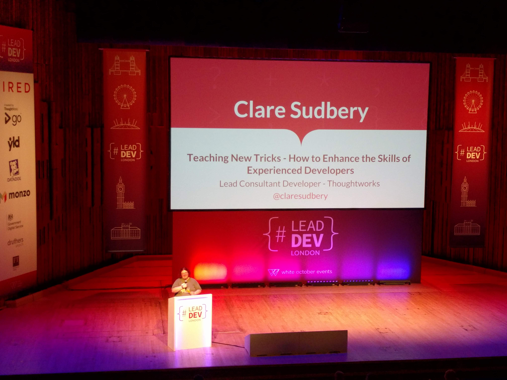

# 'Teaching New Tricks - How to Enhance the Skills of Experienced Developers' by Clare Sudbery (Lead Developer @ Thoughtworks) @claresudbery

VIDEO: [here](https://www.youtube.com/watch?v=Ue4dOfTRofg&list=PLBzScQzZ83I_VX8zgmLqIfma_kJs3RRmu&index=2&t=0s). SLIDES: TBA.

---

Not specific about WHICH skills, but does lean toward XP/TDD/Mob & Pair Programming.

Clare outlines that she is not perfect, but we are all teachers, and can learn from each other.

## Principles for the talk

- **No intellectual elitism**! You don't build effective teams with elites.
- **Empathy** with the people you're teaching. Imagine what it feels like to be the student in that situation.
- **Diversity** is what we should want in our teams. We need more developers, don't restrict it unnecessarily.

## Strategies

- Pairing!
- Workshops
  - Can be as small as a meeting, or as large as a professional event...
- Group Learning
  - This is not just a workshop, this is just informal and no-one knows anything, just learn it together
  - Don't OVERLOAD the recipients = be empathetic to their requirements/needs/limits.
- Learn by Teaching
  - If Person A is flying ahead and Person B is straggling behind, then as a facilitator ask Person A to teach it to Person B.
  - It'll slow them down, and prove that they know it, and make both people better.
- Lunch & Learn/Brown-bag sessions
- Ask Questions (and remember, no question is stupid!)
- _"All the brilliant people working on the same thing, at the same time, in the same space, on the same computer"_ (mobbing?)
  - Especially if you're starting a new feature, or doing a handover or something.
  - Devs + PO + Scrum Master + Subject Experts - EVERYONE!
- Deep Dive
  - Get a subject matter expert to take the team deep!

## Additional key points

- Safety & Security
  - No question is too stupid
  - It's OK to be you! (Apparently ThoughtWorks does this very well)
- Highlight Good Examples
- Nobody knows everything
- Let the team take ownership
  - Retros
  - Feedback
- Be open to change
- Learning is fun

## Notes

Slides have a common theme of dogs, designer made, were nice.