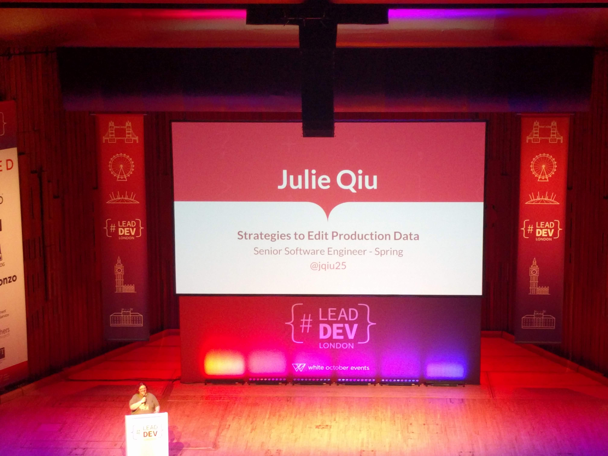

# 'Strategies to Edit Production Data' by Julie Qiu (Eng Lead @ Spring) @jqiu25

VIDEO: [here](https://www.youtube.com/watch?v=MzkjA7jzNV8&list=PLBzScQzZ83I_VX8zgmLqIfma_kJs3RRmu&index=4&t=0s). SLIDES: TBA.

---

## Why do we edit Production data?

- Internal tools are not available
- Edge cases DO exist
- Time-sensitive changes are needed

## Possible strategies

1. Raw SQL spreadsheet
2. Local scripts
3. Existing server
4. Task runner
5. Script runner service

### 1. SQL spreadsheet

Google spreadsheet that lists every query against Production

- Add record to the sheet
- Reviewer approves
- Run the query

This is easy to implement, provides an audit trail, and "promotes the right behaviours". \
BUT. \
It's very easy to make mistakes, the audit-trail is "at-will", and it's difficult to execute long and complex logic.

### 2. Local scripts

- Write a script in the language of your choice
- Connect to a remote database
- Run the script from your local terminal

This is reusable, it's easy to manipulate the output of the script, and you can access common code. \
BUT. \
It's still easy to make mistakes, outputs are only available locally, and it's possible that you can disconnect.

### 3. Existing server

- Write a script in the language of your choice
- Get the script onto the server
- SSH into the box and run the script inside a session

You can use this to run long scripts, you have reliable network connectivity, and the infrastructure already exists. \
BUT. \
Scripts can affect resources on the server, this isn't user-friendly, and there is still no audit-trail.

### 4. Task runner

- Write a script
- Code review and run tests
- Input arguments and run from Jenkins

This gives you persistent audit logs, you can do code-review and run your automated tests, and it has a user-interface (Jenkins). \
BUT. \
It's hard to manage credentials, environments are not clearly separated, and inputs are not verified.

### 5. Script runner service

- Write an application that is dedicated to writing scripts
- Write the script
- Get it reviewed
- Choose an environment (from the user-interface) and click run.

This has centralised configuration management, it separates environments and it has a user-friendly interface. \
Oh, and they can parallelise and scale, preview the results, ...AND MOAR!
BUT. \
_Oh, she skipped this bit._ :facepalm:

## Which should I use?

Her answer: any of the above. \
My answer: **NONE OF THE ABOVE!**

## Takeaways

Think about speed and usability of your solutions. \
Invest the effort (_in building your own custom solution to the problem??_) because it's worth the cost.

## Notes

I really disagree with the premise of this talk! \
**Please do not do Production updates using any of this advice.**