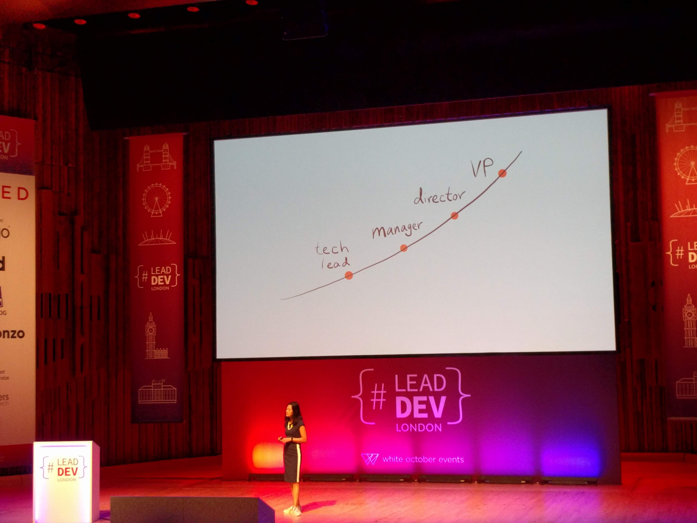

# 'Go Slow to Go Fast: Building Strong Foundations for Leadership' by Alicia Liu (VP Eng @ Nava) @aliciatweet

To be a good leader, it starts with you! ...then your team, and then the world!

This session is a long story about how Alicia has pushed herself too hard, then hit depression/insomnia, and then bought herself back by training for triathlons!!

## Key Quotes

> Management skills are very different to coding skills.
\
> Empathetic Leadership needs a healthy mind.
\
> In Asian countries, they have an actual word for "death by overwork".
\
> Recovery is about learning how to be idle.
\
> Mastering others is power; mastering yourself is true strength.
\
> You can't be a Leader without people.
\
> A gardener doesn't tell plants to grow.
\
> What got you here, won't get you there.

## Take aways

- RELAX! - Try smiling without relaxing, it doesn't work
- First Form, THEN Speed
- Embrace Discomfort, running sucks, but it's good for you
- Information != Knowledge. Applied information is knowledge
- Leadership is not a set of tools

## Look Into

- [coach.me](https://www.coach.me/)
- ['How depression made me a morning person'](https://betterhumans.coach.me/how-depression-made-me-a-morning-person-cda4889662ff) - a blog post by Alicia Liu

## Notes

Find a meditation timer and start working out!