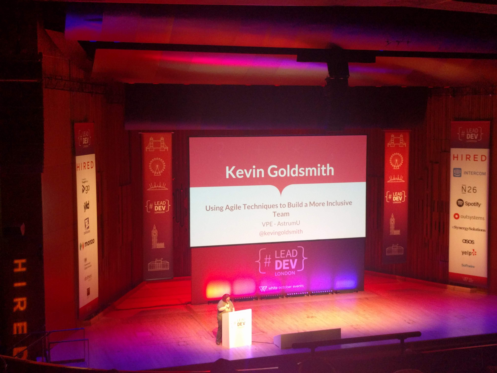

# 'Using Agile Techniques to Build More Inclusive Teams' by Kevin Goldsmith (VPE @ AstrumU) @kevingoldsmith

> AKA: Agile Techniques for Lead Developers
---

VIDEO: [here](https://www.youtube.com/watch?v=Atfxtk2Q90k&list=PLBzScQzZ83I_VX8zgmLqIfma_kJs3RRmu&index=19&t=0s). SLIDES: TBA.

---

This is not a talk about Agile... Just using some of their methodologies.

## First Sync

- "Let's discuss what we should expect from each other"
- Create a joint working agreement (Manager Readme?)
  - Use post-its and sharpies.
  - One color for expectations for me, and one for you
  - Both write up stuff on both colors
  - 10-15 minutes to make 4 piles
  - 2 columns: My Responsibilities, Your Responsibilities.
  - Discuss and review and build out the columns
  - Revisit this occasionally (every few months)

## Mentoring a Future Lead

- "What are the responsibilities of a Lead at our company?"
- Brainstorm the responsibilities of a Lead
  - Same process as above EXCEPT:
  - 4 columns: My Responsibility, I Approve, You Inform, Your Responsibility - a nice continuum
  - Discuss and review and ask lots of questions
  - Over time this should change and progress down into your responsibilities.
- This is great documentation for promotion evaluation!
- You're giving away your job, so that you can take on your bosses job :)

## Getting someone to talk in a sync

- Go for a walk! Guaranteed to take longer and start with shit and then fall into work
- Play with toys! Introduce them into your syncs and lets people relax. (Check his instagram)
- SHUT UP! Wait them out! This is very important in multicultural teams. (Awesome story here)

## Making a decision in a team meeting

- "Polling" vs "Voting"
- Very important to know which we're doing before starting the session
- Polling = I want your opinion, but I'm making the decision
  - Consequence-free input from the group, people are freer to contribute
  - Able to take the temperature on a larger decision of yours.
  - "Fist of Five" on the count of three, show me how you feel?
- Voting - We're making the decision together, and I will support the groups decision.
  - DO NOT THROW YOUR TEAM UNDER THE BUS AFTER THEY MAKE THE DECISION
  - Roman Voting, count of three: thumbs up or thumbs down
  - For teams struggling with psychological safety, then ask them to close their eyes.

## Collaborative Team Meeting Agenda

- Shared Agenda (just like the Leads Meeting)
  - Agenda is groomed on the morning-of.
  - Facilitator runs the meeting and keeps it on time.
  - Person who added the item leads the discussion.
- For larger teams: LEAN COFFEE
  - No agenda, lots of topics on post-its.
  - Dot voting and then 5 minute blocks
  - Facilitator leads the session, and once the timer goes off: Roman Voting to move on.

## More Inclusive Team Meetings

- SHUT UP! Your positional authority will encourage others to conform to your opinion.
- SET EXPECTATIONS! Be clear on the impact of the meeting. Is this a decision, or a chat?
- The "observer role", they watch and look for the behaviours. (_Maybe I can ask Barry to sit in?_)
  - Passive observer just takes notes (_At this time, Pat interrupted Ashley_) and read them back at the end
  - Active observer, when they see something, they say something.
  - Neither should have judgement, they are just observing
- Rotate roles: note-taker, facilitator, observer.
- Publish the Agenda beforehand, it's important to respect others time; let's them prepare emotionally and mentally.

## Final Thought

**Remember the power of your role!**

- You set the tone and conduct for your team based on your actions and how you react to others.
- You need to be good at helping others identify their challenges.
  - Eg.: Not addressing the "intelligent jerk" means that it's OK.

## Notes

1. Give this to the newly promoted Leads
2. Run this exercise for each of my TL's
- Investigate Esther Derby and management coaching
- Investigate Fist of Five
